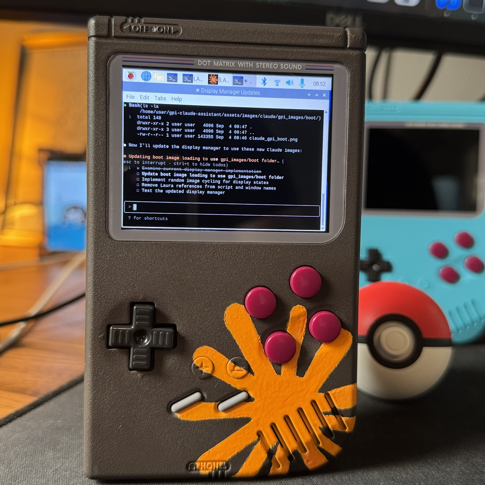

# ClaudeBoy

A GPi Case 2 repurposed as a portable edge computing device with WiFi and Bluetooth connectivity.



[](https://retroflag.com)
[](https://www.raspberrypi.com/products/compute-module-4/)
[](https://anthropic.com)
[](https://python.org)

## 🎮 Overview

ClaudeBoy transforms a Retroflag GPi Case 2 (Game Boy-style handheld) into a versatile edge computing device. The hardware can run headless or with a full 64-bit Raspberry Pi Desktop OS, providing a portable platform for AI assistants, IoT projects, or general-purpose computing.

### Hardware Hack Highlights

- **Form Factor**: Compact Game Boy-style enclosure with built-in controls
- - **Compute**: Raspberry Pi Compute Module 4 with WiFi and Bluetooth
  - - **Display**: 640x480 IPS display via DPI interface
    - - **Power**: Built-in battery with safe shutdown circuit
      - - **Connectivity**: 2.4GHz/5GHz WiFi, Bluetooth 5.0, USB-C
        - - **Storage**: MicroSD or eMMC (CM4 Lite vs standard)
         
          - ## 🔧 Hardware Requirements
         
          - | Component | Details |
          - |-----------|---------|
          - | **GPi Case 2** | Retroflag handheld enclosure |
          - | **Raspberry Pi CM4** | 4GB+ RAM recommended, WiFi variant |
          - | **MicroSD Card** | 32GB+ for OS and applications |
          - | **Pokéball Plus** | Optional - reverse-engineered as Bluetooth mouse |
          - | **Bluetooth Keyboard** | Optional - for text input |
         
          - ## 💻 Software Capabilities
         
          - ClaudeBoy can run:
         
          - 1. **Headless Mode** - SSH access, runs services in background
            2. 2. **Desktop Mode** - Full Raspberry Pi OS 64-bit with GUI
               3. 3. **Kiosk Mode** - Single-application display (AI assistant interface)
                 
                  4. ### AI Assistant Features
                 
                  5. This project includes a complete AI assistant implementation:
                 
                  6. - **Voice Control**: Wake word detection with 6+ trigger phrases (when docked)
                     - - **SSE MCP Client**: Connects to Model Context Protocol servers for distributed AI
                       - - **Pokéball Mouse**: Reverse-engineered Nintendo Pokéball Plus as Bluetooth mouse
                         - - **Game Controller Keyboard**: D-pad and buttons mapped to keyboard inputs
                           - - **Display Management**: Mood-based visual feedback system
                             - - **TTS Output**: ElevenLabs API for voice responses
                              
                               - ## 📦 Installation
                              
                               - ### Prerequisites
                              
                               - 1. **Raspberry Pi OS (64-bit)** - Fresh installation
                                 2. 2. **Python 3.11+** with virtual environment support
                                    3. 3. **Network connection** for MCP server access
                                      
                                       4. ### Quick Start
                                      
                                       5. 1. Clone the repository:
                                          2. ```bash
                                             git clone https://github.com/TwinPeaksTownie/ClaudeBoy.git
                                             cd ClaudeBoy
                                             ```

                                             2. Create virtual environment:
                                             3. ```bash
                                                python3 -m venv venv
                                                source venv/bin/activate
                                                ```

                                                3. Install dependencies:
                                                4. ```bash
                                                   pip install -r requirements.txt
                                                   ```

                                                   4. Configure API keys:
                                                   5. ```bash
                                                      cp config/client_secret.example.py config/client_secret.py
                                                      cp TTS/config/secret.example.py TTS/config/secret.py
                                                      # Edit both files with your API keys
                                                      ```

                                                      5. Fix display configuration:
                                                      6. ```bash
                                                         # CRITICAL: Edit /boot/firmware/config.txt
                                                         # Comment out: #dtoverlay=vc4-kms-v3d
                                                         # Add GPi display settings (see docs/display-config.txt)
                                                         ```

                                                         6. Run the system:
                                                         7. ```bash
                                                            ./scripts/master_launcher.sh
                                                            ```

                                                            ## 🎯 Core Components

                                                            ### Display System
                                                            - **DPI Interface**: 640x480 display using legacy framebuffer
                                                            - - **Mood States**: Visual feedback with customizable personas
                                                              - - **Pygame**: Display management and image rendering
                                                               
                                                                - ### Input Mapping
                                                               
                                                                - | Button | Keyboard | Function |
                                                                - |--------|----------|----------|
                                                                - | A | Enter | Confirm |
                                                                - | B | Escape | Cancel |
                                                                - | X | Super/Meta | Menu |
                                                                - | Y | Backspace | Delete |
                                                                - | D-Pad | Arrow Keys | Navigate |
                                                                - | L | Shift | Modifier |
                                                                - | R | Tab | Tab navigation |
                                                               
                                                                - ### AI Integration
                                                                - - **SSE MCP Client**: Server-Sent Events connection to MCP servers
                                                                  - - **Claude**: AI assistant powered by Anthropic
                                                                    - - **TTS**: ElevenLabs API for voice output
                                                                     
                                                                      - ## 🗂️ Project Structure
                                                                     
                                                                      - ```
                                                                        ClaudeBoy/
                                                                        ├── TTS/                    # Text-to-speech system
                                                                        ├── claude/                 # Claude integration
                                                                        ├── speech_capture/         # VOSK speech recognition
                                                                        ├── snowboy/                # Wake word models
                                                                        ├── system/                 # Core system management
                                                                        ├── display/                # Visual display manager
                                                                        ├── scripts/                # Launch and utility scripts
                                                                        ├── config/                 # Configuration files
                                                                        └── assets/                 # Images and sounds
                                                                        ```

                                                                        ## 🔌 Pokéball Plus Mouse

                                                                        The Pokéball Plus can be reverse-engineered as a Bluetooth LE mouse:

                                                                        ```bash
                                                                        # Reset Pokéball with pin
                                                                        # Press top button for pairing
                                                                        sudo bluetoothctl
                                                                        scan on
                                                                        # Find "Pokemon PBP"
                                                                        pair [MAC_ADDRESS]
                                                                        ```

                                                                        ## 📝 Configuration

                                                                        ### MCP Server Connection

                                                                        Edit `client_settings.json`:
                                                                        ```json
                                                                        {
                                                                          "SERVER_URL": "http://your-mcp-server:8765",
                                                                          "DEVICE_ID": "claudeboy"
                                                                        }
                                                                        ```

                                                                        ### Display Settings

                                                                        Critical boot configuration in `/boot/firmware/config.txt` - see `docs/display-config.txt` for DPI settings specific to the GPi Case 2.

                                                                        ## 🛠️ Troubleshooting

                                                                        ### Black Screen
                                                                        - Ensure `vc4-kms-v3d` is commented out in boot config
                                                                        - - Check DPI24 overlay is enabled
                                                                          - - Verify display timings match GPi Case 2 specs
                                                                           
                                                                            - ### No Audio
                                                                            - - Check TTS server: `curl http://localhost:5000/status`
                                                                              - - Verify ElevenLabs API key is configured
                                                                                - - Test: `python3 TTS/speak.py "Test message"`
                                                                                 
                                                                                  - ### Button Input Issues
                                                                                  - - Verify mapper service: `sudo systemctl status gpi-keyboard-mapper`
                                                                                    - - Check controller detection: `ls /dev/input/event*`
                                                                                      - - Test: `sudo evtest /dev/input/event1`
                                                                                       
                                                                                        - ## 🤝 Contributing
                                                                                       
                                                                                        - Contributions welcome! This project showcases human-AI collaboration.
                                                                                       
                                                                                        - 1. Fork the repository
                                                                                          2. 2. Create feature branch
                                                                                             3. 3. Follow existing code patterns
                                                                                                4. 4. Test on actual GPi Case 2 hardware
                                                                                                   5. 5. Submit pull request
                                                                                                     
                                                                                                      6. ## 📄 License
                                                                                                     
                                                                                                      7. MIT License - See LICENSE file for details.
                                                                                                     
                                                                                                      8. ## ⚠️ Disclaimer
                                                                                                     
                                                                                                      9. This project involves hardware modifications and reverse engineering. Proceed at your own risk. Not affiliated with Nintendo, Retroflag, or Anthropic.
                                                                                                     
                                                                                                      10. ---
                                                                                                     
                                                                                                      11. Built with ❤️ by Carson and Claude
